# Calculadora de Precificação Dropshipping Nacional v2.9.0

## 🎨 CSS Pack + UX Enhancement - NOVO!

**Status:** ✅ Análise Completa - Pronto para Implementação  
**Design Direction:** Professional SaaS Dashboard  
**DFII Score:** 12/15 (Excellent)  
**Total de Efeitos:** 45 (32 CSS Pack + 13 UX Essentials)

### 📚 Documentação Completa

**Comece aqui:** [`Features/CSS-Pack-Enhancement/INDEX_CSS_PACK.md`](Features/CSS-Pack-Enhancement/INDEX_CSS_PACK.md) - Índice mestre de toda a documentação

**Quick Start:**
- 🚀 [`GUIA_IMPLEMENTACAO_RAPIDA_CSS.md`](Features/CSS-Pack-Enhancement/GUIA_IMPLEMENTACAO_RAPIDA_CSS.md) - Setup em 5 minutos
- 📋 [`RESUMO_ANALISE_CSS_FINAL.md`](Features/CSS-Pack-Enhancement/RESUMO_ANALISE_CSS_FINAL.md) - Visão geral executiva
- 💻 [`EXEMPLOS_CODIGO_COMPLETO.md`](Features/CSS-Pack-Enhancement/EXEMPLOS_CODIGO_COMPLETO.md) - Código pronto para copiar

**Análise Detalhada:**
- ⭐ [`ANALISE_CSS_POR_PAGINA.md`](Features/CSS-Pack-Enhancement/ANALISE_CSS_POR_PAGINA.md) - Análise completa com React
- 🎯 [`MELHORIAS_CSS_COMPLETO_COM_URLS.md`](Features/CSS-Pack-Enhancement/MELHORIAS_CSS_COMPLETO_COM_URLS.md) - 49 efeitos + URLs
- 📖 [`CSS_PACK_CATALOGO_COMPLETO.md`](Features/CSS-Pack-Enhancement/CSS_PACK_CATALOGO_COMPLETO.md) - 254 efeitos disponíveis

### 🎯 Roadmap de Implementação (6 semanas)

| Semana | Foco | Entregável |
|--------|------|------------|
| 1 | Fundamentos UX (Crítico) | Aplicação acessível |
| 2 | Login Premium | Login profissional |
| 3 | Calculadora Interativa | Calculadora premium |
| 4 | Produtos Premium | Produtos com destaque |
| 5 | Dashboard de Vendas | Dashboard funcional |
| 6 | Refinamento | Aplicação completa |

### 🚀 Quick Start CSS Pack

```bash
# 1. Instalar dependências
npm install framer-motion @radix-ui/react-tabs @radix-ui/react-collapsible
npm install @tanstack/react-virtual @tanstack/react-query
npm install sonner lucide-react

# 2. Configurar Tailwind (ver GUIA_IMPLEMENTACAO_RAPIDA_CSS.md)

# 3. Copiar componentes base (ver EXEMPLOS_CODIGO_COMPLETO.md)
```

---

# Calculadora de Precificação Dropshipping Nacional v2.9.0

Aplicação React + TypeScript para precificação de produtos em dropshipping, considerando taxas de marketplaces (Mercado Livre, Shopee, TikTok, Enjoei), estratégias de markup e marketing de influência.

## Novas Funcionalidades (v2.9.0)

1.  **Marketing de Influencer**:
    *   Seção dedicada para cadastro de influenciadores no cálculo de tráfego orgânico.
    *   Campos dinâmicos: Nome, Instagram, TikTok, X (Twitter) e Porcentagem.
    *   Dedução automática do custo do influencer no cálculo de lucro.
2.  **Marketing de Afiliado**:
    *   Seção para cadastro de afiliados.
    *   Campos: Nome e Porcentagem de comissão.
    *   Dedução automática no cálculo de lucro (exibido como "Afiliado x%").
3.  **Refinamento de Custos**:
    *   Inclusão de custos de influenciadores e afiliados na projeção de lucro líquido.
    *   Atualização da interface de resultados para exibir esses custos detalhados.
4.  **Correções e Otimizações**:
    *   Remoção de variáveis não utilizadas e correções de lint.
    *   Otimização de imports TypeScript (Type-Only Imports).

## Novas Funcionalidades (v2.8.0)

1.  **Reputação no Mercado Livre**:
    *   Opção de marcar se possui reputação.
    *   Seleção do nível (negativa, média, positiva, líder/platinum).
2.  **Badge de Reputação no Card**:
    *   Exibição da imagem de reputação no card do produto do Mercado Livre.
3.  **Compatibilidade com Banco Legado**:
    *   Persistência e leitura de reputação mesmo quando as colunas ainda não existem.
4.  **Feedback de Cadastro**:
    *   Mensagem de sucesso e erro com comportamento consistente ao salvar produtos.
5.  **Sugestão de Preço Automática**: Baseada na margem de lucro recomendada por faixa de preço.
6.  **Markup Negativo**: Suporte para markups como -1.5x, -2.0x (divisão do custo).
7.  **Integração com Concorrente**:
    *   Campo "Preço Mínimo Concorrente".
    *   Markup sobre concorrente (positivo e negativo).
    *   Cálculo automático do "Valor Recomendado" baseado no concorrente.
8.  **Análise de Preço Manual**:
    *   Exibição de "Desconto Aplicado" ou "Acréscimo Aplicado" com percentuais.
    *   Comparação visual entre preço sugerido e preço manual.
9.  **Correção Mobile**: Suporte a vírgula e ponto em inputs numéricos.    
10. **Dimensões e Unidade de Medida**:
    *   Suporte a peso, largura, altura, profundidade e unidade de medida.
11. **Shopee Ads e Cupons**:
    *   Investimentos, palavras-chave, datas e tipos de lance.
    *   Cupons de loja, produto, seguidor e voucher do vendedor.
12. **Campanhas e Tráfego Pago**:
    *   Configurações de campanha, conjunto e anúncios por produto.
13. **Canais Orgânicos Persistidos**:
    *   Salva canais, nomes e links configurados no tráfego orgânico.
14. **Variações com Estoque e Preço Manual**:
    *   Suporte a estoque por variação e preço de venda manual por variação.
15. **Integração Bling com Categoria Automática**:
    *   Conversão automática de categorias do Bling para Mercado Livre.
16. **Persistência de Configurações de Ads**:
    *   Suporte completo para salvar configurações de Mercado Ads (Orçamento, ACOS, CPC, etc.).
    *   Suporte completo para salvar configurações de TikTok Ads (Formato, Objetivo, CPA, CPM, CTR, CVR).
    *   Visualização detalhada dos custos e métricas de Ads no card de Projeção de Lucros.


## Arquitetura e Refatoração

O código foi reestruturado seguindo os princípios de qualidade de software (SOLID, DRY, KISS, YAGNI) para garantir manutenibilidade e escalabilidade.

### Estrutura de Pastas

*   `src/components/`: Componentes UI (Visualização).
    *   `DropshippingCalculator.tsx`: Componente principal (Container).
    *   `ui/`: Componentes reutilizáveis (Input, Select, Card, CollapsibleSection).
    *   `calculator/`: Subcomponentes da calculadora (TrafficConfig, ResultsPanel, etc.).
*   `src/hooks/`: Lógica de Estado (React Hooks).
    *   `useDropshippingCalculator.ts`: Gerencia todo o estado da calculadora e handlers de input.
*   `src/services/`: Lógica de Negócio (Regras).
    *   `pricingService.ts`: Funções puras para cálculos de preço, taxas e margens.
    *   `productService.ts`: Serviços de persistência e integração com Supabase.
    *   `calculators/`: Módulos específicos por marketplace (ex: `mercadolivre.ts`).
*   `src/types/`: Definições de Tipos (TypeScript).
    *   `calculator.ts`: Interfaces compartilhadas (`CalculationResult`, `TaxRate`, `Influencer`, `Affiliate`).

### Justificativa das Mudanças (Princípios de Qualidade)

1.  **Separation of Concerns (SoC)**:
    *   **Antes**: `DropshippingCalculator.tsx` continha UI, Estado e Lógica de Cálculo misturados (>2000 linhas).
    *   **Depois**:
        *   UI fica em `components`.
        *   Estado fica em `hooks/useDropshippingCalculator`.
        *   Cálculos ficam em `services/pricingService`.
    *   **Benefício**: Facilita testes, leitura e manutenção isolada.

2.  **DRY (Don't Repeat Yourself)**:
    *   Extração do componente `CollapsibleSection` para evitar repetição de código de acordeão.
    *   Centralização das interfaces em `types/calculator.ts`.
    *   Unificação da lógica de cálculo de taxas no `pricingService`.

3.  **KISS (Keep It Simple, Stupid)**:
    *   O hook `useDropshippingCalculator` encapsula a complexidade do estado, deixando o componente UI limpo e focado em renderização.
    *   Lógica de "Markup Negativo" simplificada: `markup > 0 ? multiply : divide`.

4.  **YAGNI (You Aren't Gonna Need It)**:
    *   Remoção de lógicas duplicadas ou não utilizadas detectadas durante a auditoria.
    *   Foco nas funcionalidades solicitadas sem over-engineering.

5.  **Testabilidade**:
    *   A extração da lógica para `pricingService` permitiu a criação de testes unitários robustos (`src/services/pricingService.test.ts`) sem depender da renderização de componentes React.


# Visão Geral do Sistema

O **Dropshipping Calculator App** é uma ferramenta projetada para auxiliar vendedores de dropshipping a calcular precificação, margens e gerenciar produtos. O sistema integra-se com diversos marketplaces (Mercado Livre, Shopee, TikTok, Enjoei) e permite o cadastro e gerenciamento de produtos com suas respectivas variações e custos.

## Diagrama Entidade-Relacionamento (DER)

O diagrama abaixo ilustra a estrutura do banco de dados utilizado pela aplicação, focado na tabela principal de produtos e suas integrações.

```mermaid
erDiagram
    products {
        uuid id PK
        uuid organization_id FK
        uuid sales_channel_id FK
        text name
        text description
        numeric price
        numeric cost_price
        integer stock_quantity
        text sku
        text supplier_name
        text account_holder
        text account_type
        jsonb variations
        text[] organic_channels
        jsonb organic_channel_links
        jsonb organic_channel_names
        text image_url
        text color_hex
        numeric net_revenue
        text marketplace
        text margin_status
        text amazon_plan
        text amazon_category
        text ad_type
        boolean has_reputation
        text reputation_level
        numeric ml_shipping_cost
        text shipping_option
        numeric marketplace_shipping_cost
        text enjoei_ad_type
        text enjoei_inactivity_months
        numeric peso
        numeric largura
        numeric altura
        numeric profundidade
        text unidade_medida
        text operation_mode
        text gateway_method
        text gateway_bank
        text video_generation_llm
        text is_new_product
        text defective_product
        text facebook_delivery
        boolean shopee_use_ads
        numeric shopee_ads_cpc
        numeric shopee_daily_budget
        integer shopee_sales_quantity
        numeric shopee_total_budget
        date shopee_start_date
        date shopee_end_date
        text shopee_ad_type
        text shopee_bid_type
        jsonb shopee_keywords
        numeric shopee_max_cpc
        boolean shopee_store_coupon_enabled
        numeric shopee_store_coupon_value
        text shopee_store_coupon_type
        boolean shopee_product_coupon_enabled
        numeric shopee_product_coupon_value
        text shopee_product_coupon_type
        boolean shopee_follower_coupon_enabled
        numeric shopee_follower_coupon_value
        text shopee_follower_coupon_type
        boolean shopee_seller_voucher_enabled
        numeric shopee_seller_voucher_value
        text shopee_seller_voucher_type
        text campaign_name
        text campaign_objective
        text budget_type
        text conversion
        date start_date
        date end_date
        numeric investment_value
        text audience_location
        text audience_age
        text audience_gender
        text audience_interests
        text audience_behavior
        text placement
        text ad_text
        text ad_title
        text ad_media
        text ad_cta
        text ad_url
        text instagram_account
        boolean instant_form
        boolean is_digital
        boolean mercado_ads_enabled
        text mercado_ads_management_mode
        text mercado_ads_solution
        text mercado_ads_selection
        numeric mercado_ads_daily_budget
        numeric mercado_ads_acos_target
        numeric mercado_ads_sales_quantity
        numeric mercado_ads_cpc
        numeric mercado_ads_conversion_rate
        boolean tiktok_ads_enabled
        text tiktok_ad_format
        text tiktok_campaign_objective
        text tiktok_audience
        numeric tiktok_daily_budget
        numeric tiktok_cpa
        numeric tiktok_cpm
        numeric tiktok_ctr
        numeric tiktok_cvr
        numeric tiktok_ads_sales_quantity
        timestamptz created_at
        timestamptz updated_at
    }

    products_bling {
        uuid id PK
        uuid organization_id FK
        bigint bling_product_id
        text name
        text code
        numeric price
        text format
        text product_type
        text situation
        jsonb raw_data
        timestamptz created_at
        timestamptz updated_at
    }

    organizations {
        uuid id PK
        text name
        text slug
        text status
        timestamptz created_at
    }

    sales_channels {
        uuid id PK
        uuid organization_id FK
        bigint bling_store_id
        text name
        text marketplace
        text account_type
        text account_holder
        boolean is_active
        timestamptz created_at
        timestamptz updated_at
    }

    organic_traffic_channels {
        uuid id PK
        text key
        text label
        boolean is_active
        integer display_order
        timestamptz created_at
        timestamptz updated_at
    }

    bling_orders {
        uuid id PK
        uuid organization_id FK
        uuid sales_channel_id FK
        bigint bling_order_id
        integer order_number
        text marketplace_order_number
        bigint bling_store_id
        date order_date
        date shipping_date
        date expected_date
        numeric total_products
        numeric total_amount
        numeric discount_value
        text discount_unit
        numeric other_expenses
        integer status_id
        numeric status_value
        bigint contact_id
        text contact_name
        text contact_type
        text contact_document
        bigint seller_id
        bigint category_id
        bigint invoice_id
        numeric total_icms
        numeric total_ipi
        text observations
        text internal_observations
        text purchase_order_number
        text intermediary_cnpj
        text intermediary_username
        numeric commission_tax
        numeric shipping_cost
        numeric base_value
        integer shipping_type
        numeric shipping_value
        integer volumes_quantity
        numeric gross_weight
        integer delivery_days
        text label_name
        text label_address
        text label_number
        text label_complement
        text label_city
        text label_state
        text label_zip
        text label_neighborhood
        text label_country
        jsonb raw_data
        text sync_status
        text sync_error
        timestamptz last_sync_at
        timestamptz created_at
        timestamptz updated_at
    }

    bling_order_items {
        uuid id PK
        uuid order_id FK
        bigint bling_item_id
        uuid product_bling_id FK
        uuid product_id FK
        text code
        text description
        text detailed_description
        text unit
        numeric quantity
        numeric unit_value
        numeric discount
        numeric total_value
        numeric ipi_rate
        numeric commission_base
        numeric commission_rate
        numeric commission_value
        bigint operation_nature_id
        timestamptz created_at
        timestamptz updated_at
    }

    bling_order_installments {
        uuid id PK
        uuid order_id FK
        bigint bling_installment_id
        date due_date
        numeric value
        text observations
        text caut
        bigint payment_method_id
        timestamptz created_at
    }

    bling_sync_logs {
        uuid id PK
        uuid organization_id FK
        text event_type
        bigint bling_order_id
        text marketplace_order_number
        bigint bling_store_id
        text status
        text error_message
        jsonb webhook_data
        jsonb api_response
        timestamptz processed_at
    }

    orders {
        uuid id PK
        uuid organization_id FK
        uuid customer_id FK
        text status
        numeric total_amount
        timestamptz created_at
    }

    marketplaces {
        uuid id PK
        uuid organization_id FK
        text name
        numeric commission_rate
        boolean has_monthly_fee
        numeric monthly_fee_value
        boolean is_system
        timestamptz created_at
    }

    suppliers {
        uuid id PK
        uuid organization_id FK
        text name
        timestamptz created_at
    }

    account_holders {
        uuid id PK
        text organization_id FK
        text name
        text type
        timestamptz created_at
    }

    organizations ||--o{ products : "has"
    organizations ||--o{ products_bling : "has"
    organizations ||--o{ sales_channels : "has"
    organizations ||--o{ bling_orders : "has"
    organizations ||--o{ bling_sync_logs : "has"
    organizations ||--o{ marketplaces : "has"
    organizations ||--o{ suppliers : "has"
    organizations ||--o{ account_holders : "has"
    organizations ||--o{ orders : "has"
    
    sales_channels ||--o{ products : "categorizes"
    sales_channels ||--o{ bling_orders : "receives"
    
    bling_orders ||--o{ bling_order_items : "contains"
    bling_orders ||--o{ bling_order_installments : "has"
    
    products_bling ||--o{ bling_order_items : "references"
    products ||--o{ bling_order_items : "references"
```



### Detalhes da Tabela `products`

*   **id**: Identificador único do produto (UUID).
*   **organization_id**: Chave estrangeira ligando o produto a uma organização (multitenancy).
*   **sales_channel_id**: Chave estrangeira para o canal de venda (marketplace).
*   **name**: Nome do produto.
*   **price** / **cost_price**: Preço de venda e custo do fornecedor.
*   **stock_quantity** / **sku**: Estoque e código do produto.
*   **supplier_name** / **account_holder** / **account_type**: Dados do fornecedor e repasse.
*   **variations**: Campo JSONB para variações (cor, tamanho, estoque, etc.).
*   **organic_channels** / **organic_channel_links** / **organic_channel_names**: Canais orgânicos configurados e seus metadados (referencia keys da tabela `organic_traffic_channels`).
*   **image_url** / **color_hex**: Imagem principal e cor de destaque do card.
*   **marketplace** / **margin_status** / **net_revenue**: Contexto e resultado da precificação.
*   **amazon_plan** / **amazon_category** / **ad_type**: Dados específicos de marketplace e anúncio.
*   **has_reputation** / **reputation_level**: Reputação no Mercado Livre.
*   **ml_shipping_cost** / **shipping_option** / **marketplace_shipping_cost**: Fretes por marketplace.
*   **enjoei_ad_type** / **enjoei_inactivity_months**: Campos específicos de Enjoei.
*   **peso** / **largura** / **altura** / **profundidade** / **unidade_medida**: Dimensões e unidade de medida.
*   **operation_mode** / **gateway_method** / **gateway_bank**: Operação e gateway de pagamento.
*   **video_generation_llm**: Modelo de geração de vídeo usado.
*   **is_new_product** / **defective_product** / **facebook_delivery**: Flags operacionais.
*   **shopee_use_ads** / **shopee_ads_cpc** / **shopee_daily_budget** / **shopee_sales_quantity** / **shopee_total_budget**: Investimento em Shopee Ads.
*   **shopee_start_date** / **shopee_end_date** / **shopee_ad_type** / **shopee_bid_type** / **shopee_keywords** / **shopee_max_cpc**: Configurações e palavras-chave do Shopee Ads.
*   **shopee_store_coupon_* / shopee_product_coupon_* / shopee_follower_coupon_* / shopee_seller_voucher_***: Cupons e vouchers da Shopee.
*   **campaign_name** / **campaign_objective** / **budget_type** / **conversion**: Marketing e tráfego pago.
*   **start_date** / **end_date** / **investment_value**: Período e investimento de campanha.
*   **audience_location** / **audience_age** / **audience_gender** / **audience_interests** / **audience_behavior** / **placement**: Segmentação de anúncios.
*   **ad_text** / **ad_title** / **ad_media** / **ad_cta** / **ad_url** / **instagram_account**: Criativos e destino.
*   **instant_form**: Flag de formulário instantâneo.
*   **is_digital**: Flag indicando se é um produto digital.
*   **mercado_ads_***: Configurações de Mercado Ads (enabled, mode, solution, budget, acos, cpc, conversion, sales).
*   **tiktok_ads_***: Configurações de TikTok Ads (enabled, format, objective, audience, budget, cpa, cpm, ctr, cvr, sales).
*   **created_at** / **updated_at**: Carimbos de tempo para auditoria.

### Tabelas Auxiliares

*   **products_bling**: Produtos sincronizados do Bling ERP.
    *   `bling_product_id`: ID do produto no Bling.
    *   `raw_data`: Dados completos da API do Bling (JSONB).
*   **sales_channels**: Canais de venda (lojas/marketplaces) do Bling.
    *   `bling_store_id`: ID da loja no Bling.
    *   `marketplace`: Nome do marketplace (MercadoLivre, TikTok, Shopee, Facebook, Site).
    *   `account_type`: Tipo de conta (CPF ou CNPJ).
    *   `account_holder`: Titular da conta (Alyson, Jonatan, Emelyn).
*   **organic_traffic_channels**: Canais de tráfego orgânico disponíveis para seleção.
    *   `key`: Identificador único do canal (ex: 'youtube_shorts', 'tiktok').
    *   `label`: Nome exibido no frontend (ex: 'Youtube Shorts', 'Tiktok').
    *   `is_active`: Se o canal está ativo para seleção.
    *   `display_order`: Ordem de exibição no dropdown.
*   **bling_orders**: Pedidos de venda sincronizados do Bling.
    *   `bling_order_id`: ID do pedido no Bling.
    *   `marketplace_order_number`: Número do pedido no marketplace.
    *   `total_amount`: Valor total do pedido.
    *   `commission_tax`: Taxa de comissão do marketplace.
*   **bling_order_items**: Itens dos pedidos de venda.
    *   `product_bling_id`: Referência ao produto no Bling.
    *   `product_id`: Referência ao produto na calculadora.
    *   `code`: SKU do produto.
    *   `quantity`: Quantidade vendida.
    *   `commission_value`: Valor da comissão do item.
*   **bling_order_installments**: Parcelas dos pedidos.
*   **bling_sync_logs**: Logs de sincronização de pedidos do Bling.
*   **marketplaces**: Armazena marketplaces disponíveis. Pode conter marketplaces do sistema (`is_system = true`) e personalizados por organização.
    *   `commission_rate`: Taxa de comissão padrão (para marketplaces personalizados).
    *   `has_monthly_fee` / `monthly_fee_value`: Configuração de mensalidade.
*   **suppliers**: Lista de fornecedores (Globais ou por Organização).
*   **account_holders**: Titulares de conta para gestão financeira.
*   **orders**: Tabela para integração de pedidos (utilizada por automações n8n).
    *   `organization_id`: Vincula o pedido à loja.

## Fluxo de Autenticação

O sistema utiliza **Supabase Auth** para gerenciamento de usuários.
1.  O usuário acessa a aplicação.
2.  O `ProtectedRoute` verifica se existe uma sessão ativa.
3.  Se não houver sessão, o usuário é redirecionado para `/login`.
4.  Após login bem-sucedido, o usuário é redirecionado para a Calculadora (`/`).
.


## Testes

O projeto utiliza **Vitest** para testes unitários.

Para rodar os testes:
```bash
npx vitest run
```

## Instalação e Execução

1.  Instalar dependências:
    ```bash
    npm install
    ```
2.  Rodar servidor de desenvolvimento:
    ```bash
    npm run dev
    ```

---
**Desenvolvido por:** Jonatan Renan
**Alob Express © todos os direitos reservados**
