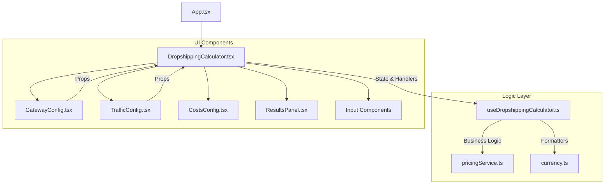
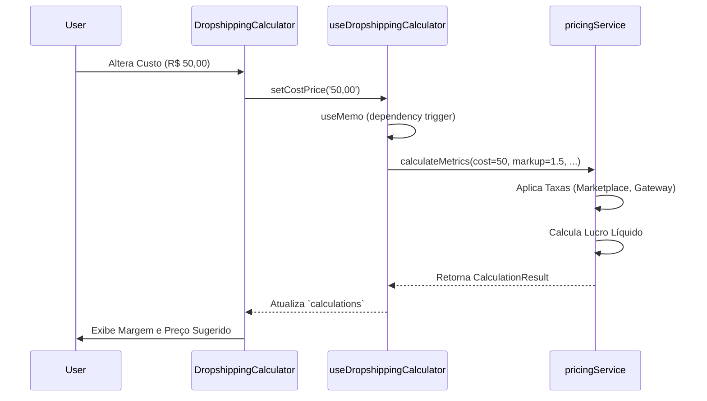

# 🏗️ Documentação Técnica Detalhada (TECHNICAL_DOCS.md)

Este documento detalha a arquitetura, especificações técnicas e fluxos de dados do **Dropshipping Calculator**.

---

## 1. Arquitetura do Sistema

### 🧩 Diagrama de Componentes (Conceitual)

A aplicação segue uma arquitetura **Single Page Application (SPA)** baseada em componentes React, utilizando o padrão **Hooks** para separação de lógica e UI.



### 🌊 Fluxo de Dados Principal
1.  **Entrada do Usuário**: Inputs em componentes de UI (`GatewayConfig`, `TrafficConfig`) atualizam o estado local no hook `useDropshippingCalculator`.
2.  **Processamento Reativo**: O hook utiliza `useMemo` para recalcular métricas automaticamente sempre que uma dependência (ex: `costPrice`, `markup`) muda.
3.  **Cálculo de Negócios**: A função `calculateMetrics` em `pricingService.ts` recebe os dados brutos, aplica taxas (Marketplace, Gateway, Impostos) e retorna um objeto `CalculationResult`.
4.  **Renderização**: O resultado é passado de volta para `DropshippingCalculator.tsx`, que distribui os dados para `ResultsPanel` e outros componentes de exibição.

### 🛠️ Tecnologias por Camada
-   **Camada de Apresentação (View)**: React 19, Tailwind CSS, shadcn/ui.
-   **Camada de Lógica (Controller/Service)**: TypeScript, Custom Hooks.
-   **Camada de Build/Infra**: Vite, pnpm, Vitest.

---

## 2. Especificações Técnicas

### 🖥️ Requisitos de Hardware (Desenvolvimento)
-   **CPU**: Dual Core 2GHz+
-   **RAM**: 4GB (8GB recomendado)
-   **Armazenamento**: 500MB livre

### 📦 Dependências Externas Principais
| Biblioteca | Versão | Propósito |
| :--- | :--- | :--- |
| `react` | ^19.2.0 | Core do Framework |
| `vite` | ^7.2.4 | Build Tool e Dev Server |
| `tailwindcss` | ^3.4.19 | Estilização Utility-First |
| `gsap` | ^3.14.2 | Animações complexas de UI |
| `lucide-react` | ^0.561.0 | Ícones SVG |
| `vitest` | ^4.0.16 | Testes Unitários |

### 🌍 Configurações de Ambiente
Não há variáveis de ambiente obrigatórias (`.env`) para execução básica, pois a lógica é puramente client-side.
-   `NODE_ENV`: Definido automaticamente pelo Vite (`development` ou `production`).

---

## 3. Estrutura de Código

### 📂 Organização de Diretórios
```
src/
├── components/          # Componentes visuais
│   ├── calculator/      # Sub-componentes específicos da calculadora
│   └── ui/              # Componentes genéricos (botões, inputs)
├── hooks/               # Lógica de estado e efeitos (Controller)
├── services/            # Lógica de negócios pura (Model/Service)
├── types/               # Definições de interfaces TypeScript
├── utils/               # Helpers (formatação de moeda, strings)
└── test/                # Testes automatizados
```

### 📏 Convenções de Codificação
-   **Nomenclatura**: PascalCase para componentes (`GatewayConfig.tsx`), camelCase para funções/hooks (`calculateMetrics`, `useDropshippingCalculator`).
-   **Estado**: Centralizado no hook principal para evitar prop drilling excessivo, exceto em componentes de UI puramente apresentacionais.
-   **Tipagem**: Uso estrito de interfaces TypeScript (`interface` vs `type`). `any` é desencorajado.

---

## 4. Fluxos Principais

### 🔄 Diagrama de Sequência: Cálculo de Preço
Este fluxo ocorre sempre que o usuário altera um valor de entrada (ex: Custo do Produto).



### ⚡ Processos Assíncronos
Atualmente, o projeto opera de forma síncrona no client-side.
-   **Futuro**: Integrações com APIs de IA (`organicApi` state) para sugestão de conteúdo serão assíncronas (`async/await`).

### 🛡️ Tratamento de Erros
-   **Validação de Input**: Inputs numéricos são sanitizados via `handleCurrencyChange` em `utils/currency.ts` para evitar `NaN`.
-   **Fallback de Cálculo**: Se dados críticos faltarem, `pricingService` retorna valores zerados ou seguros para evitar crash da UI.

---

## 5. Integrações

### 🔌 Protocolos e APIs
O sistema está preparado para integração, mas atualmente opera em modo "Simulação Local".
-   **Marketplaces (Simulado)**: As taxas do Mercado Livre (`mercadolivre.ts`) e Shopee são hardcoded baseadas nas tabelas oficiais vigentes.
-   **IA (Placeholder)**: `AI_MODELS` em `pricingService.ts` contém metadados de custo para APIs como Sora e Veo, prontos para uso em cálculos de custo de tráfego orgânico.

### 🔐 Autenticação
-   Não há camada de autenticação implementada (Acesso público).

---

## 6. Considerações de Desempenho

### 🚀 Benchmarks (Estimados)
-   **Tempo de Carregamento (FCP)**: < 1.5s (Vite + Code Splitting).
-   **Tempo de Cálculo**: < 10ms (Execução síncrona JS puro).

### 🔧 Estratégias de Otimização
-   **Memoização**: Uso intensivo de `useMemo` no hook principal para evitar recálculos desnecessários em renders de UI (ex: digitação em campos de texto que não afetam o cálculo).
-   **Lazy Loading**: Componentes pesados podem ser carregados sob demanda (atualmente não aplicado, dado o tamanho pequeno do bundle).

### ⚠️ Limitações Conhecidas
-   **Dependência do Client-Side**: Cálculos complexos dependem da CPU do usuário.
-   **Taxas Estáticas**: Alterações nas taxas dos marketplaces exigem deploy de nova versão do código.

---

## 7. Guia de Implantação

### 🏗️ Build e Deploy

1.  **Pré-requisitos**: Certifique-se de que todas as dependências estão instaladas (`pnpm install`) e os testes passam (`pnpm test`).
2.  **Build de Produção**:
    ```bash
    pnpm build
    ```
    Isso gera a pasta `dist/` com assets minificados e versionados.

3.  **Preview Local**:
    ```bash
    pnpm preview
    ```
    Simula o servidor de produção localmente para validação final.

4.  **Deploy (Exemplo Vercel/Netlify)**:
    -   Conecte o repositório Git.
    -   Comando de Build: `pnpm build`
    -   Diretório de Saída: `dist`
    -   Não são necessárias configurações extras de servidor (SPA estático).

### 🤖 Scripts Auxiliares
-   `pnpm lint`: Verifica conformidade com ESLint.
-   `pnpm dev`: Inicia ambiente de desenvolvimento.

---

*Documento gerado automaticamente pela Equipe de Engenharia - Janeiro 2026*
