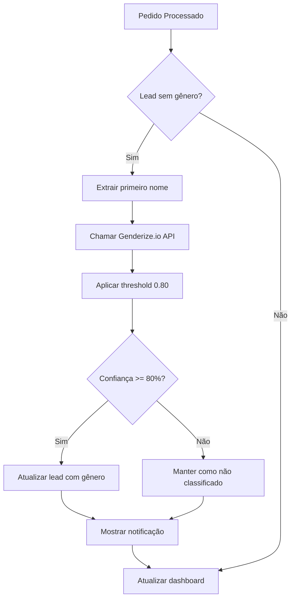

# Classificação Automática de Gênero

## 📋 Visão Geral

Sistema de classificação automática de gênero para leads quando um pedido novo é processado, utilizando a API do Genderize.io. O sistema inclui um componente visual elegante (funil) que exibe as estatísticas de classificação em tempo real.

## 🎯 Funcionalidades

### 1. Classificação Automática
- **Trigger**: Quando um pedido é processado via `process_bling_order_to_profit`
- **Condição**: Lead sem gênero classificado (`gender IS NULL`)
- **API**: Genderize.io com país padrão "BR" para melhor precisão
- **Threshold**: 0.80 (configurável via `VITE_GENDER_PROBABILITY_THRESHOLD`)

### 2. Componente Visual - Funil de Leads
- **Design**: Data-Dense Dashboard com cores azul/laranja
- **Tipografia**: Fira Code (monospace) + Fira Sans
- **Features**:
  - Donut chart interativo com distribuição de gênero
  - Cards com estatísticas (Masculino, Feminino, Não Classificados)
  - Barra de progresso da taxa de classificação
  - Botão CTA para classificar leads pendentes
  - Animações suaves e responsivo

### 3. Integração com Fluxo Existente
- Hook `useAutoGenderClassification` para gerenciar a classificação
- Integração transparente com `PendingOrders`
- Notificações toast para feedback ao usuário
- Atualização automática do dashboard após classificação

## 🏗️ Arquitetura

### Componentes

```
src/
├── components/
│   ├── sales/
│   │   └── GenderClassificationFunnel.tsx  # Componente visual do funil
│   └── PendingOrders.tsx                    # Atualizado com classificação automática
├── hooks/
│   └── useAutoGenderClassification.ts       # Hook para gerenciar classificação
├── services/
│   └── genderClassificationService.ts       # Serviço existente (reutilizado)
└── pages/
    └── Sales.tsx                            # Dashboard principal
```

### Banco de Dados

```
supabase/migrations/
└── 20260425_add_auto_gender_classification.sql
```

**Funções SQL**:
- `classify_lead_gender(p_lead_id, p_lead_name)`: Placeholder para classificação
- `process_bling_order_to_profit`: Atualizada para retornar flag `lead_needs_classification`

## 🎨 Design System

### Cores
- **Primary**: `#3B82F6` (Azul)
- **Secondary**: `#EC4899` (Rosa/Feminino)
- **CTA**: `#F97316` (Laranja)
- **Background**: `#F8FAFC` (Claro) / `#18181B` (Escuro)
- **Text**: `#1E293B` (Claro) / `#F8FAFC` (Escuro)

### Tipografia
- **Monospace**: Fira Code (para números e dados)
- **Sans-serif**: Fira Sans (para textos)

### Componentes UI
- Donut chart SVG customizado
- Cards com gradientes sutis
- Badges com cores semânticas
- Botão CTA com gradiente laranja

## 📊 Fluxo de Dados



## 🚀 Como Usar

### 1. Configurar API Key (Opcional)

```env
# .env
VITE_GENDERIZE_API_KEY=sua_api_key_aqui
VITE_GENDER_PROBABILITY_THRESHOLD=0.80
```

### 2. Aplicar Migração

```bash
# Aplicar migração no Supabase
supabase db push
```

### 3. Processar Pedido

O sistema funciona automaticamente quando um pedido é processado:

1. Usuário clica em "Processar" em um pedido pendente
2. Sistema processa o pedido normalmente
3. Se o lead não tem gênero, classifica automaticamente
4. Mostra notificação com resultado
5. Atualiza o funil de leads

### 4. Classificação Manual em Lote

Para classificar leads existentes sem gênero:

1. Visualize o funil de leads no dashboard
2. Clique no botão "Classificar X Leads Pendentes"
3. Aguarde o processamento
4. Veja as estatísticas atualizadas

## 📈 Métricas

O componente de funil exibe:

- **Total de Leads**: Quantidade total de leads
- **Masculino**: Quantidade e percentual de leads masculinos
- **Feminino**: Quantidade e percentual de leads femininos
- **Não Classificados**: Quantidade e percentual de leads sem classificação
- **Taxa de Classificação**: Percentual de leads classificados (masculino + feminino)

## 🎯 Benefícios

1. **Automação**: Classificação automática sem intervenção manual
2. **Precisão**: API Genderize.io com dados de milhões de nomes
3. **Localização**: País "BR" para melhor precisão com nomes brasileiros
4. **Transparência**: Armazena probabilidade para auditoria
5. **UX**: Feedback visual imediato e elegante
6. **Performance**: Classificação assíncrona não bloqueia o fluxo principal

## 🔧 Manutenção

### Ajustar Threshold

Para ajustar o threshold de confiança mínima:

```env
# Valores entre 0.0 e 1.0
# Padrão: 0.80 (80% de confiança)
VITE_GENDER_PROBABILITY_THRESHOLD=0.85
```

### Monitorar Quota da API

O serviço loga automaticamente os headers de rate limit:

```
[GenderClassifier] Rate Limit Status: Limit=1000, Remaining=950, Reset=3600s
```

Quando a quota está baixa (< 10 requisições):

```
[GenderClassifier] ⚠️ Quota baixa! Apenas 5 requisições restantes. Quota reseta em 3600s.
```

### Troubleshooting

**Problema**: Leads não estão sendo classificados automaticamente

**Solução**:
1. Verificar se a migração foi aplicada
2. Verificar logs do console para erros da API
3. Verificar se o lead tem nome válido
4. Verificar quota da API Genderize.io

**Problema**: Taxa de classificação muito baixa

**Solução**:
1. Reduzir threshold (ex: 0.70 em vez de 0.80)
2. Verificar qualidade dos nomes dos leads
3. Considerar usar API key para aumentar quota

## 📚 Referências

- [Genderize.io API Documentation](https://genderize.io/documentation)
- [Design System: Data-Dense Dashboard](/.kiro/skills/ui-ux-pro-max/)
- [Gender Classification Service](/src/services/genderClassificationService.ts)
