# Visão Geral do Sistema

O **Dropshipping Calculator App** é uma ferramenta projetada para auxiliar vendedores de dropshipping a calcular precificação, margens e gerenciar produtos. O sistema integra-se com diversos marketplaces (Mercado Livre, Shopee, TikTok, etc.) e permite o cadastro e gerenciamento de produtos com suas respectivas variações e custos.

## Diagrama Entidade-Relacionamento (DER)

O diagrama abaixo ilustra a estrutura do banco de dados utilizado pela aplicação, focado na tabela principal de produtos e seus atributos.

```mermaid
erDiagram
    products {
        uuid id PK
        uuid organization_id FK
        text name
        text description
        numeric price
        numeric cost_price
        integer stock_quantity
        text sku
        text supplier_name
        text account_holder
        text account_type
        jsonb variations
        text[] organic_channels
        jsonb organic_channel_links
        jsonb organic_channel_names
        text image_url
        text color_hex
        numeric net_revenue
        text marketplace
        text margin_status
        text amazon_plan
        text amazon_category
        text ad_type
        boolean has_reputation
        text reputation_level
        numeric ml_shipping_cost
        text shipping_option
        numeric marketplace_shipping_cost
        text enjoei_ad_type
        text enjoei_inactivity_months
        numeric peso
        numeric largura
        numeric altura
        numeric profundidade
        text unidade_medida
        text operation_mode
        text gateway_method
        text gateway_bank
        text video_generation_llm
        text is_new_product
        text defective_product
        text facebook_delivery
        boolean shopee_use_ads
        numeric shopee_ads_cpc
        numeric shopee_daily_budget
        integer shopee_sales_quantity
        numeric shopee_total_budget
        date shopee_start_date
        date shopee_end_date
        text shopee_ad_type
        text shopee_bid_type
        jsonb shopee_keywords
        numeric shopee_max_cpc
        boolean shopee_store_coupon_enabled
        numeric shopee_store_coupon_value
        text shopee_store_coupon_type
        boolean shopee_product_coupon_enabled
        numeric shopee_product_coupon_value
        text shopee_product_coupon_type
        boolean shopee_follower_coupon_enabled
        numeric shopee_follower_coupon_value
        text shopee_follower_coupon_type
        boolean shopee_seller_voucher_enabled
        numeric shopee_seller_voucher_value
        text shopee_seller_voucher_type
        text campaign_name
        text campaign_objective
        text budget_type
        text conversion
        date start_date
        date end_date
        numeric investment_value
        text audience_location
        text audience_age
        text audience_gender
        text audience_interests
        text audience_behavior
        text placement
        text ad_text
        text ad_title
        text ad_media
        text ad_cta
        text ad_url
        text instagram_account
        boolean instant_form
        boolean is_digital
        boolean mercado_ads_enabled
        text mercado_ads_management_mode
        text mercado_ads_solution
        text mercado_ads_selection
        numeric mercado_ads_daily_budget
        numeric mercado_ads_acos_target
        numeric mercado_ads_sales_quantity
        numeric mercado_ads_cpc
        numeric mercado_ads_conversion_rate
        boolean tiktok_ads_enabled
        text tiktok_ad_format
        text tiktok_campaign_objective
        text tiktok_audience
        numeric tiktok_daily_budget
        numeric tiktok_cpa
        numeric tiktok_cpm
        numeric tiktok_ctr
        numeric tiktok_cvr
        numeric tiktok_ads_sales_quantity
        timestamptz created_at
        timestamptz updated_at
    }

    organizations {
        uuid id PK
        text name
        text slug
        text status
        timestamptz created_at
    }

    marketplaces {
        uuid id PK
        uuid organization_id FK
        text name
        numeric commission_rate
        boolean has_monthly_fee
        numeric monthly_fee_value
        boolean is_system
        timestamptz created_at
    }

    suppliers {
        uuid id PK
        uuid organization_id FK
        text name
        timestamptz created_at
    }

    account_holders {
        uuid id PK
        text organization_id FK
        text name
        text type
        timestamptz created_at
    }

    organizations ||--o{ products : "has"
    organizations ||--o{ marketplaces : "has"
    organizations ||--o{ suppliers : "has"
    organizations ||--o{ account_holders : "has"
```

### Detalhes da Tabela `products`

*   **id**: Identificador único do produto (UUID).
*   **organization_id**: Chave estrangeira ligando o produto a uma organização (multitenancy).
*   **name**: Nome do produto.
*   **price** / **cost_price**: Preço de venda e custo do fornecedor.
*   **stock_quantity** / **sku**: Estoque e código do produto.
*   **supplier_name** / **account_holder** / **account_type**: Dados do fornecedor e repasse.
*   **variations**: Campo JSONB para variações (cor, tamanho, estoque, etc.).
*   **organic_channels** / **organic_channel_links** / **organic_channel_names**: Canais orgânicos configurados e seus metadados.
*   **image_url** / **color_hex**: Imagem principal e cor de destaque do card.
*   **marketplace** / **margin_status** / **net_revenue**: Contexto e resultado da precificação.
*   **amazon_plan** / **amazon_category** / **ad_type**: Dados específicos de marketplace e anúncio.
*   **has_reputation** / **reputation_level**: Reputação no Mercado Livre.
*   **ml_shipping_cost** / **shipping_option** / **marketplace_shipping_cost**: Fretes por marketplace.
*   **enjoei_ad_type** / **enjoei_inactivity_months**: Campos específicos de Enjoei.
*   **peso** / **largura** / **altura** / **profundidade** / **unidade_medida**: Dimensões e unidade de medida.
*   **operation_mode** / **gateway_method** / **gateway_bank**: Operação e gateway de pagamento.
*   **video_generation_llm**: Modelo de geração de vídeo usado.
*   **is_new_product** / **defective_product** / **facebook_delivery**: Flags operacionais.
*   **shopee_use_ads** / **shopee_ads_cpc** / **shopee_daily_budget** / **shopee_sales_quantity** / **shopee_total_budget**: Investimento em Shopee Ads.
*   **shopee_start_date** / **shopee_end_date** / **shopee_ad_type** / **shopee_bid_type** / **shopee_keywords** / **shopee_max_cpc**: Configurações e palavras-chave do Shopee Ads.
*   **shopee_store_coupon_* / shopee_product_coupon_* / shopee_follower_coupon_* / shopee_seller_voucher_***: Cupons e vouchers da Shopee.
*   **campaign_name** / **campaign_objective** / **budget_type** / **conversion**: Marketing e tráfego pago.
*   **start_date** / **end_date** / **investment_value**: Período e investimento de campanha.
*   **audience_location** / **audience_age** / **audience_gender** / **audience_interests** / **audience_behavior** / **placement**: Segmentação de anúncios.
*   **ad_text** / **ad_title** / **ad_media** / **ad_cta** / **ad_url** / **instagram_account**: Criativos e destino.
*   **instant_form**: Flag de formulário instantâneo.
*   **is_digital**: Flag indicando se é um produto digital.
*   **mercado_ads_***: Configurações de Mercado Ads (enabled, mode, solution, budget, acos, cpc, conversion, sales).
*   **tiktok_ads_***: Configurações de TikTok Ads (enabled, format, objective, audience, budget, cpa, cpm, ctr, cvr, sales).
*   **created_at** / **updated_at**: Carimbos de tempo para auditoria.

### Tabelas Auxiliares

*   **marketplaces**: Armazena marketplaces disponíveis. Pode conter marketplaces do sistema (`is_system = true`) e personalizados por organização.
    *   `commission_rate`: Taxa de comissão padrão (para marketplaces personalizados).
    *   `has_monthly_fee` / `monthly_fee_value`: Configuração de mensalidade.
*   **suppliers**: Lista de fornecedores (Globais ou por Organização).
*   **account_holders**: Titulares de conta para gestão financeira.

## Fluxo de Autenticação

O sistema utiliza **Supabase Auth** para gerenciamento de usuários.
1.  O usuário acessa a aplicação.
2.  O `ProtectedRoute` verifica se existe uma sessão ativa.
3.  Se não houver sessão, o usuário é redirecionado para `/login`.
4.  Após login bem-sucedido, o usuário é redirecionado para a Calculadora (`/`).
.
