# Visão Geral do Sistema e Arquitetura de Dados

O **Dropshipping Calculator App** é uma ferramenta projetada para auxiliar vendedores de dropshipping a calcular precificação, margens e gerenciar produtos. O sistema integra-se com diversos marketplaces (Mercado Livre, Shopee, TikTok, Enjoei) e permite o cadastro e gerenciamento de produtos com suas respectivas variações e custos.

## Diagrama Entidade-Relacionamento (DER)

O diagrama abaixo ilustra a estrutura do banco de dados utilizado pela aplicação, focado na tabela principal de produtos e suas integrações.

```mermaid
erDiagram
    products {
        uuid id PK
        uuid organization_id FK
        uuid sales_channel_id FK
        text name
        text description
        numeric price
        numeric cost_price
        integer stock_quantity
        text sku
        text supplier_name
        text account_holder
        text account_type
        jsonb variations
        text[] organic_channels
        jsonb organic_channel_links
        jsonb organic_channel_names
        text image_url
        text color_hex
        numeric net_revenue
        text marketplace
        text margin_status
        text amazon_plan
        text amazon_category
        text ad_type
        boolean has_reputation
        text reputation_level
        numeric ml_shipping_cost
        text shipping_option
        numeric marketplace_shipping_cost
        text enjoei_ad_type
        text enjoei_inactivity_months
        numeric peso
        numeric largura
        numeric altura
        numeric profundidade
        text unidade_medida
        text operation_mode
        text gateway_method
        text gateway_bank
        text video_generation_llm
        text is_new_product
        text defective_product
        text facebook_delivery
        boolean shopee_use_ads
        numeric shopee_ads_cpc
        numeric shopee_daily_budget
        integer shopee_sales_quantity
        numeric shopee_total_budget
        date shopee_start_date
        date shopee_end_date
        text shopee_ad_type
        text shopee_bid_type
        jsonb shopee_keywords
        numeric shopee_max_cpc
        boolean shopee_store_coupon_enabled
        numeric shopee_store_coupon_value
        text shopee_store_coupon_type
        boolean shopee_product_coupon_enabled
        numeric shopee_product_coupon_value
        text shopee_product_coupon_type
        boolean shopee_follower_coupon_enabled
        numeric shopee_follower_coupon_value
        text shopee_follower_coupon_type
        boolean shopee_seller_voucher_enabled
        numeric shopee_seller_voucher_value
        text shopee_seller_voucher_type
        text campaign_name
        text campaign_objective
        text budget_type
        text conversion
        date start_date
        date end_date
        numeric investment_value
        text audience_location
        text audience_age
        text audience_gender
        text audience_interests
        text audience_behavior
        text placement
        text ad_text
        text ad_title
        text ad_media
        text ad_cta
        text ad_url
        text instagram_account
        boolean instant_form
        boolean is_digital
        boolean mercado_ads_enabled
        text mercado_ads_management_mode
        text mercado_ads_solution
        text mercado_ads_selection
        numeric mercado_ads_daily_budget
        numeric mercado_ads_acos_target
        numeric mercado_ads_sales_quantity
        numeric mercado_ads_cpc
        numeric mercado_ads_conversion_rate
        boolean tiktok_ads_enabled
        text tiktok_ad_format
        text tiktok_campaign_objective
        text tiktok_audience
        numeric tiktok_daily_budget
        numeric tiktok_cpa
        numeric tiktok_cpm
        numeric tiktok_ctr
        numeric tiktok_cvr
        numeric tiktok_ads_sales_quantity
        timestamptz created_at
        timestamptz updated_at
    }

    products_bling {
        uuid id PK
        uuid organization_id FK
        bigint bling_product_id
        text name
        text code
        numeric price
        text format
        text product_type
        text situation
        jsonb raw_data
        timestamptz created_at
        timestamptz updated_at
    }

    organizations {
        uuid id PK
        text name
        text slug
        text status
        timestamptz created_at
    }

    sales_channels {
        uuid id PK
        uuid organization_id FK
        bigint bling_store_id
        text name
        text marketplace
        text account_type
        text account_holder
        boolean is_active
        timestamptz created_at
        timestamptz updated_at
    }

    organic_traffic_channels {
        uuid id PK
        text key
        text label
        boolean is_active
        integer display_order
        timestamptz created_at
        timestamptz updated_at
    }

    bling_orders {
        uuid id PK
        uuid organization_id FK
        uuid sales_channel_id FK
        bigint bling_order_id
        integer order_number
        text marketplace_order_number
        bigint bling_store_id
        date order_date
        date shipping_date
        date expected_date
        numeric total_products
        numeric total_amount
        numeric discount_value
        text discount_unit
        numeric other_expenses
        integer status_id
        numeric status_value
        bigint contact_id
        text contact_name
        text contact_type
        text contact_document
        bigint seller_id
        bigint category_id
        bigint invoice_id
        numeric total_icms
        numeric total_ipi
        text observations
        text internal_observations
        text purchase_order_number
        text intermediary_cnpj
        text intermediary_username
        numeric commission_tax
        numeric shipping_cost
        numeric base_value
        integer shipping_type
        numeric shipping_value
        integer volumes_quantity
        numeric gross_weight
        integer delivery_days
        text label_name
        text label_address
        text label_number
        text label_complement
        text label_city
        text label_state
        text label_zip
        text label_neighborhood
        text label_country
        jsonb raw_data
        text sync_status
        text sync_error
        timestamptz last_sync_at
        timestamptz created_at
        timestamptz updated_at
    }

    bling_order_items {
        uuid id PK
        uuid order_id FK
        bigint bling_item_id
        uuid product_bling_id FK
        uuid product_id FK
        text code
        text description
        text detailed_description
        text unit
        numeric quantity
        numeric unit_value
        numeric discount
        numeric total_value
        numeric ipi_rate
        numeric commission_base
        numeric commission_rate
        numeric commission_value
        bigint operation_nature_id
        timestamptz created_at
        timestamptz updated_at
    }

    bling_order_installments {
        uuid id PK
        uuid order_id FK
        bigint bling_installment_id
        date due_date
        numeric value
        text observations
        text caut
        bigint payment_method_id
        timestamptz created_at
    }

    bling_sync_logs {
        uuid id PK
        uuid organization_id FK
        text event_type
        bigint bling_order_id
        text marketplace_order_number
        bigint bling_store_id
        text status
        text error_message
        jsonb webhook_data
        jsonb api_response
        timestamptz processed_at
    }

    orders {
        uuid id PK
        uuid organization_id FK
        uuid customer_id FK
        text status
        numeric total_amount
        timestamptz created_at
    }

    marketplaces {
        uuid id PK
        uuid organization_id FK
        text name
        numeric commission_rate
        boolean has_monthly_fee
        numeric monthly_fee_value
        boolean is_system
        timestamptz created_at
    }

    customers {
        uuid id PK
        uuid organization_id FK
        text name
        text email
        text phone
        text document
        text city
        text state
        timestamptz created_at
    }

    leads {
        uuid id PK
        uuid organization_id FK
        text name
        text email
        text phone
        text status
        numeric conversion_value
        text origin
        timestamptz created_at
    }

    products ||--o{ products_bling : "integrates_with"
    organizations ||--o{ products : "owns"
    organizations ||--o{ sales_channels : "configures"
    organizations ||--o{ bling_orders : "receives"
    sales_channels ||--o{ bling_orders : "processes"
    bling_orders ||--o{ bling_order_items : "contains"
    products_bling ||--o{ bling_order_items : "item_product"
    products ||--o{ bling_order_items : "local_product"
    bling_orders ||--o{ bling_order_installments : "paid_via"
    organizations ||--o{ bling_sync_logs : "records"
    organizations ||--o{ orders : "manages"
    organizations ||--o{ marketplaces : "defines"
    organizations ||--o{ customers : "serves"
    organizations ||--o{ leads : "tracks"
```

